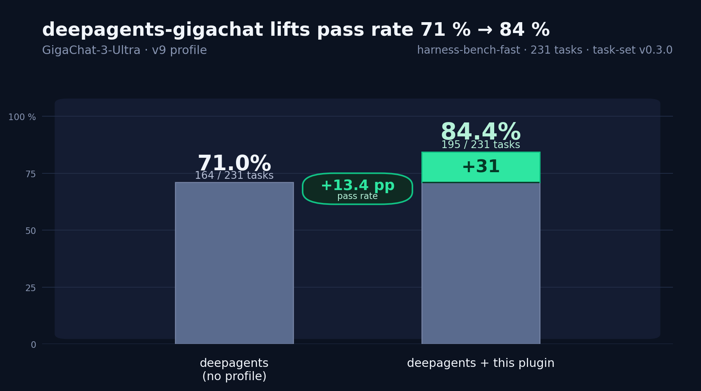

# deepagents-gigachat



A [`HarnessProfile`](https://docs.langchain.com/oss/python/deepagents/profiles#harness-profiles)
for [`deepagents`](https://github.com/langchain-ai/deepagents) tuned for
[GigaChat](https://giga.chat/) models. On the
[`harness-bench-fast`](https://github.com/ai-forever/harness-bench-fast)
371-task agent benchmark (v0.14.0) the profile reaches **331 / 371 (89.2 %)**
with `GigaChat-3-Ultra` — see the [Benchmark](#benchmark) section for
methodology and historical results.

The profile replaces the default `deepagents` system prompt, rewrites the
descriptions of file and shell tools (`ls`, `read_file`, `write_file`, `glob`,
`grep`, `edit_file`, `execute`) to match GigaChat's tool-calling behavior, and
adds middleware for structured reasoning, shell safety, path normalization,
memory-task nudges, and loop breaking.

Once installed, the profile is registered automatically via the
`deepagents.harness_profiles` entry point — no code changes required.

## Structure

- `deepagents_gigachat/harness_profile.py` — GigaChat `HarnessProfile`, middleware, tool overrides
- `deepagents_gigachat/prompts.py` — system prompt variants (`native_fs`, `tool_agnostic`, …)
- `deepagents_gigachat/__init__.py` — exports `register_harness()`, `set_workspace_path()`, …

## Requirements

- Python 3.12+
- `deepagents` **>= 0.6.7** (0.6.x filesystem API; see [Filesystem backend](#filesystem-backend))
- `uv` (for dependency installation and execution)

## Installation

```bash
uv sync
```

Downstream users can install the published package from PyPI with:

```bash
pip install deepagents-gigachat
```

## Configuration

Provide one of the authentication options in your shell environment. If your
launcher loads dotenv files, for example `deepagents-code`, these values can also
live in `.env`:

- `GIGACHAT_CREDENTIALS`
- or `GIGACHAT_USER` + `GIGACHAT_PASSWORD`

Optional GigaChat settings:

```bash
GIGACHAT_BASE_URL="https://gigachat.sberdevices.ru/v1"
GIGACHAT_MODEL="GigaChat-3-Ultra"
GIGACHAT_VERIFY_SSL_CERTS=False
GIGACHAT_PROFANITY_CHECK=False

# Optional override for the built-in model context-window table.
DEEPAGENTS_GIGACHAT_CONTEXT_WINDOW=261120
DEEPAGENTS_GIGACHAT_SUMMARIZATION_TRIGGER=0.85
```

## Use With `deepagents`

Install this package into the same Python environment where `deepagents` runs:

```bash
pip install deepagents-gigachat
```

For local development, install the built wheel instead:

```bash
uv build
uv pip install dist/*.whl
```

After installation, `deepagents` discovers the profile automatically through the
`deepagents.harness_profiles` entry point:

```toml
[project.entry-points."deepagents.harness_profiles"]
gigachat = "deepagents_gigachat:register_harness"
```

The package entry point is named `gigachat` for discovery. The harness profile
is registered under both provider keys: `gigachat` for model specs such as
`gigachat:GigaChat-3-Ultra`, and `giga` as a compatibility alias.

For a minimal inline `create_deep_agent` + `GigaChat` snippet, see
[Examples](#examples). It works as long as your GigaChat credentials are
available in environment variables (`GIGACHAT_CREDENTIALS` or
`GIGACHAT_USER` + `GIGACHAT_PASSWORD`).

### Filesystem backend

This profile is tuned for runners that use a **local filesystem backend with
`virtual_mode=True`** — the setup used by `harness-bench-fast` and recommended
for `deepagents-code` when agents work inside an isolated workspace directory.

With `virtual_mode=True`:

- **File tools** (`read_file`, `write_file`, `edit_file`, `grep`, `glob`, `ls`)
  treat the workspace root as `/`. Use **relative paths** in tool calls:
  `notes.md`, `src/utils.py` — not host absolute paths like
  `/Users/you/project/notes.md`.
- **`execute`** still runs in the **host shell** working directory (the workspace
  folder). Shell commands must also use **relative** paths: `cat data.csv` works,
  `cat /data.csv` does not.

The profile includes `PathNormalizerMiddleware` to strip leading `/` from
`grep`/`glob` results so the agent writes relative paths into output files.

Always pass `virtual_mode` explicitly when constructing the backend — in
deepagents 0.6.x the default is still `False`, but the 0.6 API expects an
explicit choice:

```python
from deepagents import create_deep_agent
from deepagents.backends import LocalShellBackend
from langchain_gigachat import GigaChat

backend = LocalShellBackend(root_dir=".", virtual_mode=True)
agent = create_deep_agent(
    model=GigaChat(
        model="GigaChat-3-Ultra",
        profile={"max_input_tokens": 261_120},
    ),
    backend=backend,
)
```

If you run with `virtual_mode=False`, filesystem tool paths follow the real host
filesystem instead; the relative-path prompts in this profile will not match
that mode.

### Context window and automatic summarization

`deepagents` includes automatic conversation summarization. Before each model
call it estimates the size of the system prompt, messages, tool calls, tool
results, and tool schemas. When the configured threshold is reached, older
messages are persisted under `/conversation_history`, summarized, and replaced
in the effective model request by a summary plus a recent unsummarized tail.
The raw graph message log is retained.

The stock model-aware policy is:

- summarize at 85% of `model.profile["max_input_tokens"]`;
- preserve the newest 10% of the context window;
- truncate large arguments from old file-tool calls before full compaction;
- summarize and retry when a model raises LangChain's `ContextOverflowError`.

`langchain-gigachat` 0.5.x does not currently populate `model.profile`.
Without this information, `deepagents` falls back to a 170,000-token trigger,
which is not derived from the selected GigaChat deployment. It also cannot
recognize the provider-specific HTTP 422 `CONTEXT_TOO_LONG` response as a
LangChain context overflow by itself.

The GigaChat `GET /models/{model}` response contains the model ID, object type,
and owner, but does not expose a context-window field. Until the API and SDK
provide it, the harness maintains an explicit model table. The value below was
measured against the production API on 2026-08-03; deployments can differ, so
explicit model metadata or an environment override takes precedence:

| Model IDs | Context window |
| --- | ---: |
| `GigaChat`, `GigaChat-Pro`, `GigaChat-Max` | 261,120 |
| `GigaChat-2`, `GigaChat-2-Pro`, `GigaChat-2-Max`, `GigaChat-2-Reasoning` | 261,120 |
| `GigaChat-3-Lightning`, `GigaChat-3-Pro`, `GigaChat-3-Ultra` | 261,120 |

Version suffixes such as `GigaChat-3-Ultra:32.3.18.5`, provider prefixes, and
the `-preview` suffix are normalized before lookup.

For the complete stock behavior, pass the profile explicitly when constructing
the model using metadata from your deployment:

```python
model = GigaChat(
    model="GigaChat-3-Ultra",
    profile={"max_input_tokens": 261_120},
)
```

The harness profile also installs `ContextWindowGuardMiddleware` for
already-created, unprofiled model instances. For IDs in the table it performs
proactive compaction at 85% of the model window. Unknown IDs use the reactive
fallback: a GigaChat payload-too-large response is translated into
`ContextOverflowError`, allowing Deep Agents to compact and retry instead of
failing the run.

Override the table for a deployment without changing application code:

```bash
DEEPAGENTS_GIGACHAT_CONTEXT_WINDOW=261120
DEEPAGENTS_GIGACHAT_SUMMARIZATION_TRIGGER=0.80
```

When configured, the guard estimates the complete request and triggers the
standard Deep Agents compaction path at the selected fraction. It only preempts
requests when there is enough message history to compact. A single oversized
initial prompt cannot be repaired by conversation summarization and should be
reduced or moved into workspace files instead.

## Use With `deepagents-code`

Step-by-step setup for using GigaChat as the default model in
`deepagents-code` through its config file.

### 1. Install `deepagents-code`, the GigaChat provider, and this plugin

All three must end up in the **same** Python environment so that `deepagents-code`
can both construct a `GigaChat` model and discover the harness profile
via the `deepagents.harness_profiles` entry point:

```bash
uv tool install deepagents-code --with langchain-gigachat,deepagents-gigachat
```

(or `pip install ...` if you're not using `uv`).

### 2. Provide credentials

GigaChat accepts two authentication styles. Pick one.

**Option A: Authorization Key (one base64-encoded string).** Get the key
from `developers.sber.ru` → your project → credentials section, then
export it:

```bash
export GIGACHAT_CREDENTIALS="<base64-encoded auth key>"
```

**Option B: User + password.** If you have a `user`/`password` pair
instead of a single key:

```bash
export GIGACHAT_USER="<your client id>"
export GIGACHAT_PASSWORD="<your client secret>"
```

You can also put either pair into a `.env` file next to where you launch
`deepagents-code` — it reads `.env` on startup. The plugin itself never
parses these variables: `langchain-gigachat` picks them up when it
constructs the model.

### 3. Configure `~/.deepagents/config.toml`

Create the file (the directory may not exist yet — `mkdir -p ~/.deepagents`
first) and put the snippet below into it. Each block is annotated.

```toml
[models]
# The model used when you launch `deepagents-code` with no extra flags.
# Format: "<provider>:<model name>". The provider key here ("gigachat")
# is the same one this plugin registers its harness profile under.
default = "gigachat:GigaChat-3-Ultra"

[models.providers.gigachat]
# Models exposed to the "/model" picker. Add or remove freely.
models = [
    "GigaChat-3-Ultra",
    "GigaChat-2-Max",
    "GigaChat-Max",
    "GigaChat-Pro",
    "GigaChat",
]
# Tells `deepagents-code` which Python class to instantiate when a
# `gigachat:*` spec is requested.
class_path = "langchain_gigachat.chat_models.gigachat:GigaChat"
# If you authenticate via GIGACHAT_CREDENTIALS, this line wires it up.
# Remove this line if you use GIGACHAT_USER + GIGACHAT_PASSWORD instead.
api_key_env = "GIGACHAT_CREDENTIALS"

[models.providers.gigachat.params]
# Constructor kwargs passed straight to `GigaChat(...)`. Anything that
# `langchain_gigachat.GigaChat` accepts can go here.
base_url = "https://gigachat.sberdevices.ru/v1"
verify_ssl_certs = false
profanity_check = false
timeout = 600
# Optional sampling knobs (defaults are sensible; uncomment to override):
# temperature = 0.0
# top_p = 1.0
# repetition_penalty = 1.0

[models.providers.gigachat.profile]
# Tells the profile resolver that this provider supports tool
# calling and which model to default to when the user types just
# "gigachat" without a model name.
tool_calling = true
default_model_hint = "GigaChat-3-Ultra"
```

### 4. Run `deepagents-code`

```bash
deepagents-code
```

On startup, `deepagents-code` loads the config, instantiates `GigaChat` with the
parameters above, and `deepagents` automatically picks up this plugin's
harness profile via its `deepagents.harness_profiles` entry point — so
GigaChat-specific system prompt, tool description overrides and the
`think` middleware are applied without any extra code.

### Switching models

Three independent ways to override the default at runtime:

- **Inside `deepagents-code`:** type `/model gigachat:GigaChat-Pro` to switch the
  current session.
- **From the shell, per-launch:** `deepagents-code --model gigachat:GigaChat-Max`.
- **From the environment:** set `GIGACHAT_MODEL=GigaChat-Pro` before
  launching. (This is honoured by `langchain-gigachat` itself when the
  model name isn't pinned in the config.)

## Examples

Runnable examples live in [`examples/`](examples/). The simplest one is
`examples/basic_agent.py`: it constructs a `GigaChat` model, wraps it in
`create_deep_agent`, and asks a single question. Run it with:

```bash
uv run python examples/basic_agent.py
```

Or run this minimal inline example:

```python
from deepagents import create_deep_agent
from langchain_gigachat import GigaChat

agent = create_deep_agent(
    model=GigaChat(model="GigaChat-3-Ultra"),
    system_prompt="You are a helpful assistant.",
)
result = agent.invoke({"messages": "Hi! What can you do?"})
```

## Benchmark

The benchmark used to validate every profile version of this plugin
now lives in its own repo:
[`ai-forever/harness-bench-fast`](https://github.com/ai-forever/harness-bench-fast).
It is a self-contained agent evaluation (currently **371 tasks**, v0.14.0)
covering file creation/editing, refactors, project-wide `grep`/`glob`, CSV /
JSON / JSONL / YAML / TOML / INI / XLSX / SQLite pipelines, pytest-graded
implementations, composite multi-step pipelines, merge/conflict resolution,
terminal-style parsing, policy/action JSON tasks, and `MEMORY.md` discipline.
Every verifier is mechanical — no LLM-as-judge.

Latest results on the full 371-task set, `GigaChat-3-Ultra` at
`gigachat.sberdevices.ru/v1`, `LocalShellBackend(virtual_mode=True)`:

| Configuration                   | PASS / 371 | %      |
| ------------------------------- | ---------- | ------ |
| `deepagents` + this plugin      | 331 / 371  | 89.2 % |

Historical uplift on the earlier 231-task subset of the same bench:

| Configuration                          | PASS / 231 | %      | Δ                  |
| -------------------------------------- | ---------- | ------ | ------------------ |
| stock `deepagents`, no profile         | 164 / 231  | 71.0 % | —                  |
| `deepagents` + this plugin (v9)        | 195 / 231  | 84.4 % | +31 (+13.4 pp)     |

Current middleware stack: `ThinkToolMiddleware`, `ShellSafetyMiddleware`,
`PathNormalizerMiddleware`, `ContextWindowGuardMiddleware`,
`DeterministicOutputMiddleware`, `SpecificationAuditMiddleware`,
`MemoryTaskMiddleware`, `LoopBreakerMiddleware`, optional
`ToolContractMiddleware`, plus `base_system_prompt` and tool description
overrides.

For a plain-language explanation of the latest reliability changes, review
findings, and their full benchmark validation, see
[`docs/review-fixes-and-benchmark-2026-08-05.md`](docs/review-fixes-and-benchmark-2026-08-05.md).

## Lint

Linting, tests, and package build checks are required in CI:

```bash
uv run ruff check .
uv run pytest
uv build
```
